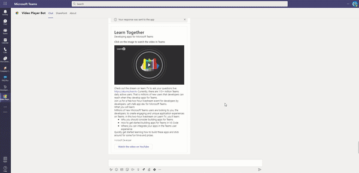

# Teams Video Player Bot

Bot Framework v4 Conversation Bot sample for Teams.

This bot has been created using [Bot Framework](https://dev.botframework.com) and uses the source code provided on GitHub [microsoft/BotBuilder-Samples](https://github.com/microsoft/BotBuilder-Samples/tree/main/samples/javascript_nodejs/02.echo-bot) has a baseline.

This sample shows how to play a video within Microsoft Teams from an Adaptive Card. This demonstrator supports public hosted videos (like YouTube) as well as content hosted on Microsoft SharePoint online. For SharePoint online, the solution implements SSO: the current user watching the video in Teams is transparently authenticated on SharePoint Online and can read the video based on the permissions set on the SharePoint site (user needs to be authorized)

<p align="center">
    
</p>

## Prerequisites

- Microsoft Teams is installed and you have an account
- [NodeJS](https://nodejs.org/en/) to run the code
- [ngrok](https://ngrok.com/) or equivalent tunnelling solution 
- A SharePoint site to host the video content (or a public site to host the videos)
- An Azure subscription to register the Azure Bot (and optionally deploy the solution)

## To try this sample

> Note: these instructions are for running the sample on your local machine, the tunnelling solution (like ngrok) is required because the Teams service needs to call into the bot.

1) Clone the repository

    ```bash
    git clone https://github.com/OfficeDev/Teams-Video-Player-Bot.git
    ```

2) In a terminal, navigate to `Teams-Video-Player-Bot`

    ```bash
    cd ./Teams-Video-Player-Bot
    ```

3) Install modules

    ```bash
    npm install
    ```

4) Run ngrok - point to port 3978

    ```bash
    ngrok http -host-header=rewrite 3978
    ```

5) Create [Bot Framework registration resource](https://docs.microsoft.com/en-us/azure/bot-service/bot-service-quickstart-registration) in Azure

   **Note for the deployment**: don't select "UserAssignedMSI" if you run your bot locally - This option only works when running in Azure. Please select **"Single-Tenant"** or **"Multi-Tenant"** instead.

   Once the Azure Bot is deployed, go to your Azure Bot under "Configuration":

    - For the "Messaging endpoint" URL, use the current https URL you were given by running ngrok and append it with the path /api/messages. It should look like **https://{subdomain}.ngrok.io/api/messages** to work.
    - Select "Manage" close to "Microsoft App ID" to open the Azure AD app registration - Go to "API permissions" > "Add permission" > "Microsoft Graph" > "Application permissions" > "**TeamsAppInstallation.ReadForUser.All**" > "Add permissions" - Then "Grant admin consent" for your tenant - [Learn more about permissions and consent](https://docs.microsoft.com/en-us/azure/active-directory/develop/v2-permissions-and-consent?WT.mc_id=Portal-Microsoft_AAD_RegisteredApps)
    - Ensure that you've [enabled the Teams Channel](https://docs.microsoft.com/en-us/azure/bot-service/channel-connect-teams?view=azure-bot-service-4.0)

    **Note:** the permission TeamsAppInstallation.ReadForUser.All is required to automatically get the internal Teams appID from the external appID set in the manifest.json file. This internal appID is generated dynamically when the app is uploaded into Teams (sideloaded or via the store)


6) Create the [Teams application package](https://docs.microsoft.com/en-us/microsoftteams/platform/concepts/build-and-test/apps-package)
    - **Edit** the `manifest.json` contained in the  `appPackage` folder to replace:
      - your **Microsoft App Id** (that was created when you registered your bot earlier) in the place holder string `<<YOUR-MICROSOFT-APP-ID>>`
      - your **SharePoint domain** (the SharePoint site where your videos are located) in the place holder string `<<YOUR-SPO-DOMAIN>>` - Note: if you **don't intend** to play videos hosted on SharePoint, you can remove the sections named "staticTabs" and "webApplicationInfo" from the app manifest.
      - your **Video site domain** (the public location where your videos are located) in the place holder string `<<VIDEO-SITE-DOMAIN>>`
    - **Zip** up the contents of the `appPackage` folder to create a `manifest.zip` - Note: please make sure that you zip the files directly and not the folder that contains the files.
    - **Upload** the `appPackage.zip` to Teams (in the Apps view click "Upload a custom app") - More info on this [page](https://docs.microsoft.com/en-us/microsoftteams/platform/concepts/deploy-and-publish/apps-upload)

7) Update the `.env` configuration for the Azure Bot settings and provided the parameters value:
   - **Microsoft App Id** (aka client ID)
   - **Microsoft App Password** (aka client secret)
   - **MicrosoftAppType** (aka Bot Type)
   - **MicrosoftAppTenantId**
   
   [More info here](https://docs.microsoft.com/en-us/azure/bot-service/bot-service-quickstart-registration?view=azure-bot-service-4.0&tabs=userassigned#bot-identity-information) on the how to set these values.

   Last, update the .env file with the baseURL if you run your app locally - This value will be the URL generated by ngrok.

8) Run your bot at the command line:

    ```bash
    npm start
    ```

## Interacting with the bot

You can interact with this bot by sending it a message, or selecting a command from the command list. To start the conversation, just send **Hello** in the chat with the bot - For simplicity, the bot only support personal chats. 

When you say "Hello", the bot sends a card with option to use the demo card (running a YouTube video) or create a custom one.
- If you select "demo card", the bot sends an adaptive card with the same format as the [Company Communicator](https://github.com/OfficeDev/microsoft-teams-apps-company-communicator) application.
- If you select "custom card", the bot send an adaptive card to request information about your video - You need to provide the following info:
  - **Video name** : The name of your video
  - **Video URL**  : The location of your video - URL has to be in **https://** format
  - **Website URL**: The URL where the video is located (can be the same as the video URL itself) - URL has to be in **https://** format
  
The bot will then answer with an Adaptive Card that contains an image - Click on the image to play the video in a Stage View.

**Note for SharePoint videos:**
- to get the URL of the video, go to SharePoint online, slect the video and click on "Details" - Then copy the "Path" value (e.g. https://microsoft.sharepoint.com/teams/mysite/Shared%20Documents/myvideosfolder/myvideo.mp4)
- make sure that users that receive the videos also have access to its SharePoint location. 

## Deploy the bot to Azure

To learn more about deploying a bot to Azure, see [Deploy your bot to Azure](https://aka.ms/azuredeployment) for a complete list of deployment instructions.

## Further reading

- [How Microsoft Teams bots work](https://docs.microsoft.com/en-us/azure/bot-service/bot-builder-basics-teams?view=azure-bot-service-4.0&tabs=javascript)
- [Tabs link unfurling and Stage View](https://docs.microsoft.com/en-us/microsoftteams/platform/tabs/tabs-link-unfurling)

## Contributing

This project welcomes contributions and suggestions.  Most contributions require you to agree to a
Contributor License Agreement (CLA) declaring that you have the right to, and actually do, grant us
the rights to use your contribution. For details, visit https://cla.opensource.microsoft.com.

When you submit a pull request, a CLA bot will automatically determine whether you need to provide
a CLA and decorate the PR appropriately (e.g., status check, comment). Simply follow the instructions
provided by the bot. You will only need to do this once across all repos using our CLA.

This project has adopted the [Microsoft Open Source Code of Conduct](https://opensource.microsoft.com/codeofconduct/).
For more information see the [Code of Conduct FAQ](https://opensource.microsoft.com/codeofconduct/faq/) or
contact [opencode@microsoft.com](mailto:opencode@microsoft.com) with any additional questions or comments.

## Trademarks

This project may contain trademarks or logos for projects, products, or services. Authorized use of Microsoft 
trademarks or logos is subject to and must follow 
[Microsoft's Trademark & Brand Guidelines](https://www.microsoft.com/en-us/legal/intellectualproperty/trademarks/usage/general).
Use of Microsoft trademarks or logos in modified versions of this project must not cause confusion or imply Microsoft sponsorship.
Any use of third-party trademarks or logos are subject to those third-party's policies.
